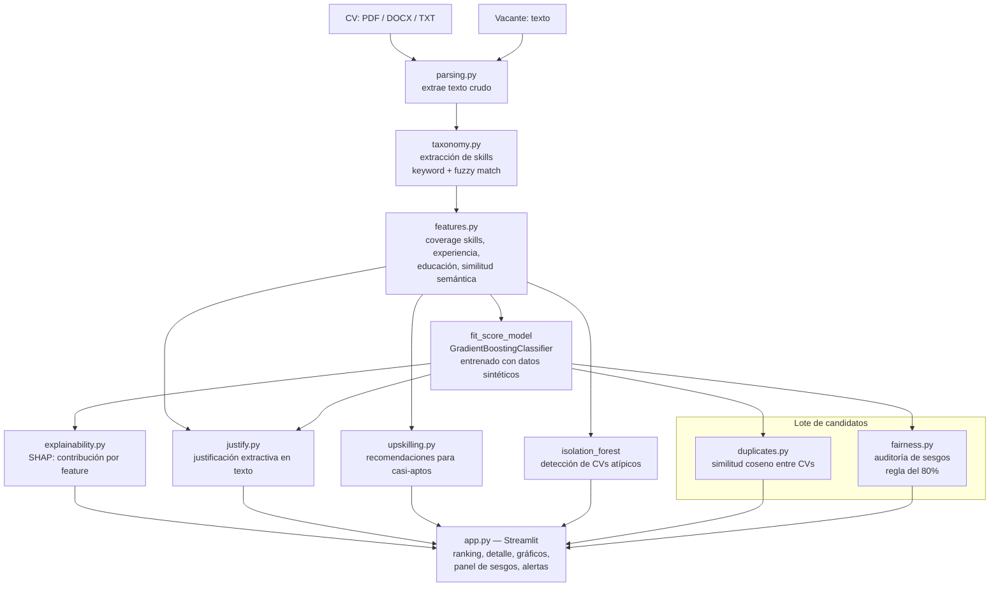

# Arquitectura del Sistema

## Diagrama de flujo

## Componentes y responsabilidad única

| Módulo | Responsabilidad |
|---|---|
| `parsing.py` | Extraer texto crudo de PDF/DOCX/TXT |
| `taxonomy.py` | Detectar skills mediante taxonomía propia + fuzzy matching (rapidfuzz), sin API |
| `features.py` | Ingeniería de features: cobertura de skills, experiencia, educación, similitud semántica (embeddings locales) |
| `synthetic_data.py` | Generación del dataset de entrenamiento sintético con etiqueta ground-truth transparente |
| `train_model.py` | Entrenamiento y evaluación del modelo de fit-score (núcleo de IA) |
| `anomaly.py` | Detección de CVs atípicos (keyword-stuffing) con IsolationForest |
| `explainability.py` | Explicación por SHAP de cada predicción individual |
| `justify.py` | Justificación en texto natural, extractiva (sin LLM) |
| `upskilling.py` | Recomendaciones de mejora para candidatos casi aptos |
| `duplicates.py` | Detección de CVs duplicados/plagiados dentro de un mismo lote |
| `fairness.py` | Auditoría de sesgos del resultado (no del input del modelo) |
| `scoring_pipeline.py` | Orquesta todo el flujo end-to-end, expone `score_candidate` y `score_batch` |
| `app.py` | Interfaz Streamlit |

## Integraciones externas

**Ninguna API externa de pago.** El único recurso descargado es el modelo de embeddings
`all-MiniLM-L6-v2` (Hugging Face, open source, se cachea localmente tras la primera descarga).
Todo el resto del pipeline — parsing, extracción de skills, modelo de scoring, explicabilidad,
detección de anomalías/duplicados y auditoría de sesgos — corre localmente con scikit-learn,
rapidfuzz y shap.
